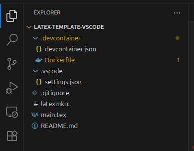
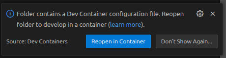
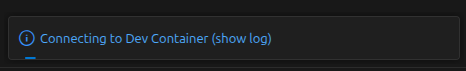
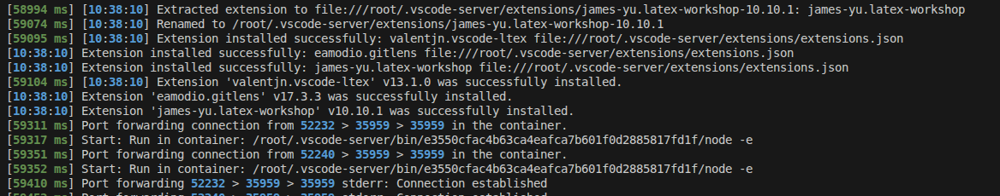
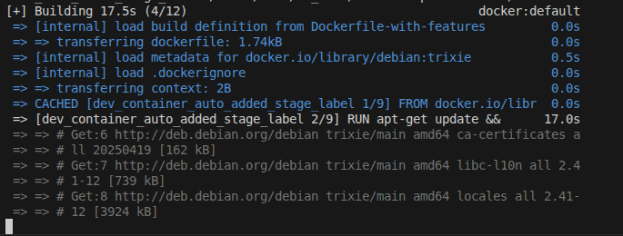
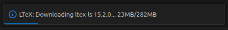
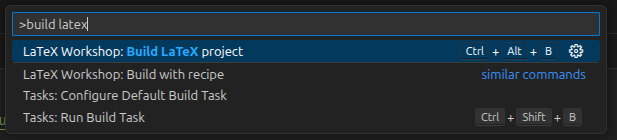
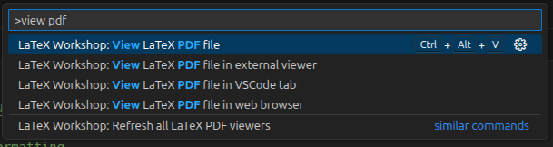
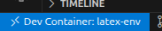
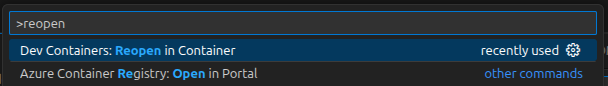

# `latex-template-vscode`

Ce dépôt est une base pour compiler un projet $\LaTeX$ en local depuis VSCode.

## Principe

L'idée est d'installer un compilateur $\LaTeX$ en local sur la machine, à l'intérieur d'un conteneur Docker (pour faire très simple, une sorte de machine virtuelle mais en plus léger). L'avantage est que le conteneur est un environnement d'exécution isolé et que la configuration de ce conteneur dépend uniquement d'un fichier de configuration (le fichier `Dockerfile`), ce qui fait que ce template fonctionne sur n'importe quelle machine avec très peu de configuration requise !

Ce conteneur s'intègre dans VSCode sous la forme d'un `devcontainer`. Tout se passe comme si VSCode était connecté à une machine virtuelle, qui est ici le conteneur Docker.

## Prérequis

* ~10 Go d'espace disque libre
* VSCode
* Fonctionne sous Linux, Windows, Mac OS (non testé).

## Mise en place

1. Installer [Docker Engine](https://docs.docker.com/engine/) (ou [Docker Desktop](https://docs.docker.com/desktop/), en particulier si vous êtes sous Windows ou Mac OS).
1. Lancer Docker et le laisser ouvert en arrière-plan.
1. Ouvrir VSCode et installer le pack d'extension "Remote Development" (`ms-vscode-remote.vscode-remote-extensionpack`)
1. Télécharger ce dépôt (sous GitHub, bouton `Code` en haut à droite > `Download ZIP`) et l'extraire dans un dossier à part.
1. Ouvrir le dossier qui vient d'être extrait dans VSCode (`Fichier` > `Ouvrir un Dossier`). Vous devriez voir le contenu suivant :

   

1. La pop-up suivante devrait apparaître dans VSCode après ouverture du dossier :

   

   Cliquer sur `Reopen in Container`.
   (Si elle n'apparaît pas, appuyer sur `Ctrl+Maj+P` pour ouvrir la `Command Palette` et taper `Reopen in Container` puis valider avec `Entrée`).
1. La fenêtre VSCode se recharge et cette notification apparaît :

   

   Cliquer dessus (_sur le texte_) pour voir l'avancement de la création du conteneur. Cela devrait ressembler à ça :

   

   Puis ensuite vous devriez voir la création du conteneur Docker lui-même :

   

1. Attendez jusqu'à ce que la création du conteneur se termine (cela peut prendre un peu temps de temps, il y a plusieurs Go à télécharger et installer). Après la dernière étape, cette notification apparaît :

  

1. Une fois le téléchargement terminé, ça y est, le conteneur $\LaTeX$ est installé. (Cette longue étape d'installation ne se fait qu'une seule fois, les fois suivantes, le conteneur déjà créé sera directement utilisé par VSCode).

## Utilisation 

1. Pour compiler votre projet :
   1. Copier les fichiers du projet dans le dossier ouvert dans VSCode.
   2. Ouvrir le fichier `.tex` principal.
   3. Ouvrir la `Command Palette` de VSCode :
      * soit avec le raccourci `Ctrl+Maj+P`
      * soit depuis le menu `View` (`Affichage` en français) > `Command Palette`
   4. Dans la `Command Palette`, taper `build latex` et sélectionner `LaTeX Workshop: Build LaTeX project` (ou utiliser le raccourci `Ctrl+Alt+B`).

     

   5. Vous pouvez tester avec le fichier `main.tex` de ce dépôt.
3. Le PDF issu de la compilation se trouve dans le dossier `out/`.
4. Pour voir le PDF issu de la compilation directement depuis VSCode, taper `view pdf` dans la `Command Palette` et sélectionner `LaTeX Workshop: View PDF file`. Le PDF s'ouvre alors dans un onglet dans VSCode.

   
   
5. Terminé ! Vous pouvez à présent écrire du $\LaTeX$ et compiler depuis VSCode. La prochaine fois que vous ouvrez ce projet dans VSCode (il faut bien lancer Docker avant d'ouvrir VSCode), assurez-vous bien d'être dans le conteneur : pour le voir, regardez en bas à gauche dans VSCode. Si vous voyez `DevContainer: latex-env` alors tout est bon, sinon ouvrez la `Command Palette` et sélectionnez `Reopen in Container`.
   
   
   
   
